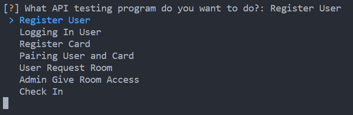

# SMART DOOR TESTING TOOL

> Peralatan digunakan untuk melakukan pengetesan terhadap Endpoint. Tool ini dibuat dengan memanfaatkan multithread. Semakin besar nilai thread yang digunakan mensimulasikan semakin banyak user yang terkneksi dalam satu waktu.

---

## Daftar Konten

1. [Instalasi](#instalasi)
2. [Penggunaan](#penggunaan)

## Instalasi

Sebelum menjalankan program, pastikan menggunakan python **3.x** atau versi yang lebih baru. Program ini telah di coba dan berjalan dengan baik menggunakan python versi **3.11**. Untuk menginstall semua library yang diperlukan:

```python
    py -m pip freeze
```

Setelah melakukan instalasai library, program dapat dijalankan dengan menggunakan perintah:

```python
    py main.py
```

## Penggunaan

Sebelum melakukan pengujian pastikan anda memiliki sebuah database file dengan ektensi `*.json`. File tersebut berisi data array dengan _dictionary_ yang berisi:

```json
[
    {
        "username": "string",
        "email": "string",
        "password": "string",
        "cardNumber": "string",
        "pin": "string"
    }
]
```

Gunakan program [ini](https://github.com/dimasaulia/data-generator) untuk membuat data yang diperlukan.

Ketika program pertama dieksekusi terdapat pilihan untuk melakukan pengetesan tertentu.



Program harus dijalankan secara berururutan dengan proses **logging in user** dapat dilewati. Setelah memilih program yang ingin di jalankan, anda perlu memasukan path menuju data yang ingin diujikan. Data harus berakhiran **.json**. Setelah itu masukan nama output file yang diinginkan, file yang dihasilkan adalah file berformat **.xlsx**. File tersebut akan berisi respon yang diberikan server beserta respon time setiap requestnya. Sebelum program benar-benar berjalan anda perlu memasukan banyak Thread yang ingin digunakan. Semakin banyak thread yang digunakan maka semakin cepat proses eksekusi script tetapi semakin lama respon time yang diberikan server. Hal itu terjadi karena semakin banyak Thread yang digunakan berarti semakin banyak user yang terkoneksi dalam satu waktu yang menyebabkan server memerlukan waktu lebih lama untuk mengeksekusi setiap tugasnya.
